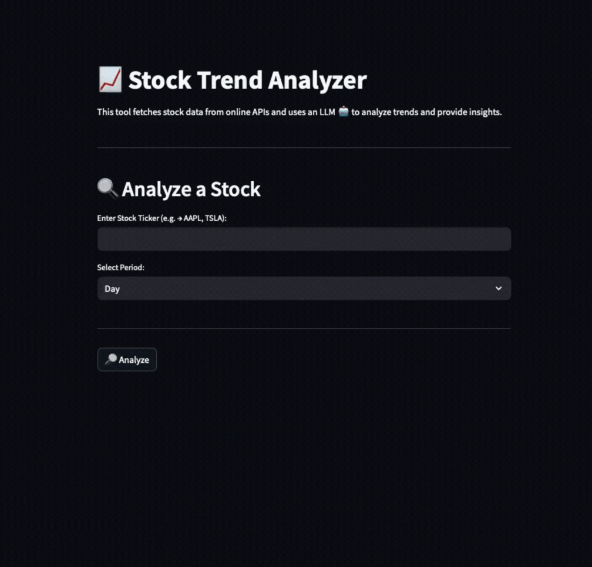

# Stock Trend Analyzer

## Overview

**Stock Trend Analyzer** is a user-friendly web app that fetches recent stock price data and uses a Large Language Model (LLM) to analyze the trend (upward, downward, or neutral) and predict possible causes. The app supports both cloud-based (OpenAI) and local (Ollama) LLMs, and uses the Marketstack API for stock data.




---

## Features
- Fetches stock price data for the last day, week, or month
- Analyzes trends and predicts causes using LLMs
- Supports local LLMs via [Ollama](https://ollama.com/) or cloud LLMs via [OpenAI](https://platform.openai.com/)
- Simple, interactive UI built with [Streamlit](https://streamlit.io/)

---

## About the Technologies

### Streamlit
- An open-source Python library for building interactive web apps quickly and easily.
- [Streamlit Documentation](https://docs.streamlit.io/)

### Ollama
- A platform for running open-source LLMs locally, in a container or on your machine.
- [Ollama Documentation](https://github.com/ollama/ollama)

### OpenAI
- Provides powerful cloud-based LLMs (like GPT-3.5, GPT-4) via API.
- [OpenAI API Docs](https://platform.openai.com/docs/)

### Marketstack API
- Real-time and historical stock market data API.
- [Marketstack Documentation](https://marketstack.com/documentation)

---

## Installation & Usage

### 1. **Clone the Repository**
```sh
git clone https://github.com/christopher11/stock-trend-analyzer.git
cd stock-trend-analyzer
```

### 2. **Set Up Python Virtual Environment**
```sh
python3 -m venv venv
source venv/bin/activate
pip install -r requirements.txt
```

### 3. **Set Up Environment Variables**
Create a `.env` file in the project root with the following (edit as needed):

```
# Marketstack API Key (required)
MARKETSTACK_API_KEY=your_marketstack_api_key

# Use local LLM (Ollama) or OpenAI
LOCAL_LLM=true                # true for Ollama, false for OpenAI
LOCAL_LLM_MODEL=gemma3:1b   # e.g., llama3, gemma3:1b


# OpenAI (if LOCAL_LLM=false)
OPENAI_API_KEY=sk-...         # Your OpenAI API key
OPENAI_MODEL=gpt-3.5-turbo    # or gpt-4o, etc.
```

**You must get a free Marketstack API key from [marketstack.com](https://marketstack.com/).**

---

### 4. **Run the App**
```sh
streamlit run app.py
```
- Open [http://localhost:8501](http://localhost:8501) in your browser.

---

## Local LLM (Ollama) Setup (Optional)
If you want to use a local LLM, you need to run Ollama separately. This project provides an `ollama/` directory with a `docker-compose.yml` and `start-ollama.sh` script to preload the default model.

1. **Go to the Ollama directory:**
   ```sh
   cd ollama
   ```
2. **Start Ollama and preload the model:**
   ```sh
   docker-compose up --build
   ```
   This will start Ollama and preload the default model (e.g., `gemma3:1b`).
3. **Make sure your `.env` in the main app points to the correct URL:**
   ```
   LOCAL_LLM_URL=http://localhost:11434
   ```

---

## Usage
- Enter a stock ticker (e.g., `AAPL`, `TSLA`)
- Select the period (Day, Week, Month)
- Click **Analyze**
- The app will fetch the latest data, analyze the trend, and provide a user-friendly explanation and prediction of the cause.

---

## Credits & Resources
- [Streamlit](https://streamlit.io/)
- [Ollama](https://ollama.com/)
- [OpenAI](https://platform.openai.com/)
- [Marketstack](https://marketstack.com/)

---

**Feel free to contribute or open issues!** 
